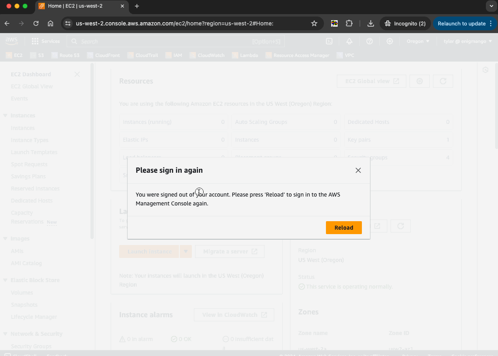

# Remove AWS Signout Overlay

## Demo




## Usage

3 options:

### A. Paste the script into the developer console as needed

```js
const parent_element = document.getElementById("awsc-nav-reload-modal-root")
parent_element.firstChild.remove()
```

### B. Create a bookmark with this as the URL, then open the bookmark whenever you want to remove the overlay

```
javascript:(function()%7Bconst%20parent_element%20%3D%20document.getElementById(%22awsc-nav-reload-modal-root%22)%0Aparent_element.firstChild.remove()%7D)()%3B
```

### C. Use this as a Chrome extension

1. Download this repo as a zip file ([DOWNLOAD LINK](https://github.com/enigmango/Remove-AWS-Signout-Overlay/archive/refs/heads/main.zip)), then unzip it
2. Open Chrome's [Extensions page](chrome://extensions)
3. Enable developer mode (top right toggle)
4. Click `Load Unpacked` (top left button)
5. Select the unzipped folder from step 1 to install the extension
6. Click the extension icon whenever you need it